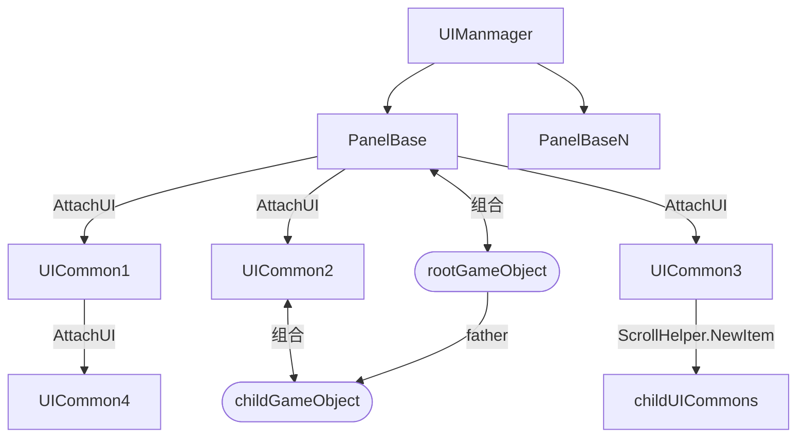

## 这是什么

这是一个Unity项目的脚本部分。

Unity项目本身是基于HDRP的物理相机，模拟现实中相机的变焦、对焦、测光、曝光效果。并且添加了一些类似《零》系列中的锁定、模糊效果。

演示视频：https://www.bilibili.com/video/BV1TobzzUEQQ/

#### 为什么有这个项目

目的是实现一个大多数中小型游戏中都能通用的客户端代码框架。这个项目是一个测试。

这个框架在代码维护、易用性、性能开销上有一定的取舍。

1. 解耦游戏对象GameObject和游戏脚本
   + 一些脚本能够在服务器和客户端之间复用
   + VC分离，能够实例化大量的脚本对象，但不实例化具体的GameObject
   + 通过CustomDictionary存储游戏对象数据，预计能够做到统一的数据库存储和状态同步
2. 解耦ui gameobject和脚本
   + 把UI Gameobject的Prefab当做UXML的功能来看
   + 同理VC分离，能假实例化大量的脚本对象。能让一个脚本对应多种UI，或是一个UI对应多种脚本。
   + 动态加载、卸载UI、易分割UI树。
   + 不使用Mono的可视化绑定，意味着对文本代码的更好支持-尤其是让AI能读懂代码。


## 重要的类

#### **UnionInt64**

这是一个能存储任意值类型的值类型，目的是解耦外部使用类型和存储实际类型。比如：

```c#
UnionInt64 u = 1919;
float f = u;
UnionInt64 u2 = new Vector2Int(114, 514);
Vector2 v2 = u2;
```

+ 外部需要高精度类型，可以使用存储的整形、低精度类型。

+ 可以自定义不同类型的转换规则

#### EventProxy

封装观察者模式，便于代码的维护和使用

```c#
// playerMovementComp继承了CustomDictionary, CustomDictionary继承了EventProxy
InVokeEvent("OnFocusTargetChanged", targetMono);

playerMovementComp.RegisterEvent<CameraTargetMono>("OnFocusTargetChanged", OnFocusTargetChanged);
playerMovementComp.UnRegisterEvent<CameraTargetMono>("OnFocusTargetChanged", OnFocusTargetChanged);
```

#### CustomDictionary-->EventProxy

继承了EventProxy同时，允许其他对象监听其所包含的UnionInt64被改变的事件。

```c#
//takePhotoCameraComp继承了CustomDictionary
//像这样定义所需的变量
protected static Dictionary<string, UnionInt64> slotMap = new Dictionary<string, UnionInt64>
{
    // 这里存储的都是UnionInt64
	{ "isoIdx", 3 },
    { "focusIdxCenterOffset", new Vector2Int(0, 0)}, // 中心对焦坐标
    { "focalLength", 24.0f},
    { "exposureControlType", (int)ExposureControlType.ShutterSpeed },
	...
}
public TakePhotoCameraComp(PrimaryPlayer player) : base(player, slotMap, fixedSlot:true)// fixedSlot为false允许添加新的键
{
}

//像这样修改isoIdx值，就会出发Prop修改事件
private void SetISOIdx(int idx)
{
    idx = Math.Clamp(idx, 0, evParaValue.isoValues.Length - 1);
    SetValue("isoIdx", idx);
}

// 其他地方监听、取消监听变量
var comp = G.player.takePhotoCameraComp;
comp.RegisterProp<int>("apertureIdx", OnApertureIdxChanged); //两种写法
comp.UnRegisterProp("isoIdx", (Action<int, int>)OnISOIdxChanged);
public void OnISOIdxChanged(int oldIdx, int newIdx)
{
    UpdateISOText();
}
...


```

## 游戏逻辑框架

#### 解耦Monobehaviour的组件式构成

一个存在于游戏客户端的对象应该只有一个GameObject，其他Comp都继承EventCompBase（EventCompBase->CustomDictionary->EventProxy）

```c#
public class PrimaryPlayer : MonoBehaviour
{
    public StateComp stateComp { get; private set; }
    public AttrComp attrComp { get; private set; }
    public TakePhotoCameraComp takePhotoCameraComp { get; private set; }
    public PlayerMovementComp playerMovementComp { get; private set; }
    public SfxComp sfxComp { get; private set; }

    void Awake()
    {
        stateComp = new StateComp(this);
        attrComp = new AttrComp(this);
        takePhotoCameraComp = new TakePhotoCameraComp(this);
        playerMovementComp = new PlayerMovementComp(this);
        sfxComp = new SfxComp(this);
    }
    // 在这里写Primaryplayer实际和客户端引擎交互的行为
}
public class TakePhotoCameraComp : EventCompBase
{
    //写一些具体的游戏逻辑
    public void ChangedRealWantBaseEV100(float diff)
    {
        diff = Mathf.Clamp(diff, -1.0f, 1.0f);
        RealWantBaseEV100 -= diff;
        UpdateShutterAndAperture(WantBaseEV);
        RealWantBaseEV100 = ShutterApertureEV + EVCompensation - ISOEV;
        UpdateTargetOutRangeSettings();
    }
}
```

**优势**

+ 大量减少Monobehaviour的数量，从而降低运行、创建、销毁开销，
+ 便于修改Update、Start、Destroy的时机和顺序，能减少意外调用（Unity自带的不好使）
+ 解耦游戏逻辑和引擎API，便于移植到服务器自定义行为
  + 如果需要的话，示例里的PrimaryPlayer可以改为不继承，组合一个MonoBehaviour，但需要额外管理PrimaryPlayer的生命周期。
+ 无需用GetComponent。

#### 事件触发为主导的游戏逻辑：

如上文示例中，任何地方都可以监听Comp的变量改变以及其自定义的事件。并且只需要**2行代码**即可完成。

对于计时器，也是类似的方式

```c#
private void OnFadeout()
{
    clearTimer = G.RegisterTimer(0.3f, ShowResultFinish, repeateCount: 1);
}
protected override void OnUnload()
{
    if (clearTimer > 0)
    {
        G.UnRegisterTimer(clearTimer);
        clearTimer = 0;
    }
    base.OnUnload();
}
```

##### 优势

+ 十分易用，减少对Update的依赖，从而减少逻辑开销。
+ 解耦不同对象，以及同一对象的不同Comp，便于维护。

## UI

UI在不同游戏中会有很大的不同，并且会带很多隐形规则来简化写代码。这里给出一种实现方式。



+ 如图所示，UI框架的结构是一个树形。
+ UICommon会关联一个Prefab（**默认类名和Prefab名字相同**）实例化后的根GameObject，以此操作GameObject。
+ PanelBase是UICommon的子类
+ 创建时从PanelBase开始，深度优先递归创建子UICommon和其GameObject
+ 因此PanelBase所关联的GameObject是**所有子孙UICommon所关联的GameObject的祖父**。
+ 除了PanelBase和ScrollHelper外，**其他UICommon不销毁UI**

#### 创建UI

```c#
public abstract class UICommon
{
    // 引擎中的GameObject，指向Prefab实例化后的根节点
    public RectTransform transform { get; protected set; }
    public GameObject gameObject => transform.gameObject;
    //记录父子关系
    protected UICommon parent;
    protected HashSet<UICommon> m_Children = null;
    
    //实例化一个对象，和一个GameObject进行组合。
    //创建树形结构
    public static T DynamicAttach<T>(UICommon parent, GameObject prefabGameObject, RectTransform attachPos,.. aspectFit) where T : UICommon, new()
    {
        T uiCommon = new T();
        RectTransform rectTransform = GameObject.Instantiate(prefabGameObject, attachPos)?.GetComponent<RectTransform>();
        if (rectTransform == null)
        {
            Debug.LogError($"Failed to instantiate UI prefab {prefabGameObject.name} at attach position {attachPos.name}.");
            return null;
        }
        Helpers.EnsureAspectRatioFitter(rectTransform, aspectFit);
        uiCommon.parent = parent;
        parent.m_Children ??= new HashSet<UICommon>();
        parent.m_Children.Add(uiCommon);
        uiCommon.transform = rectTransform;
        uiCommon.__on_load__();
        return uiCommon;
    }
}


//PanelBase本身就是UICommon
public class PanelBase : UICommon
{
    //和UICommon的创建大致相同，但是它的transform会绑定在canvas上
    public static T InitPanel<T>(string panelName, Dictionary<int, Canvas> uiCanvases) where T : PanelBase, new()
    {
        GameObject prefab = Helpers.FindUIPrefab(panelName);
        if (prefab == null)
        {
            return null;
        }
        RectTransform rectTransform = GameObject.Instantiate(prefab)?.GetComponent<RectTransform>();
        if (rectTransform == null)
        {
            Debug.LogError($"Failed to instantiate UI prefab {panelName}.");
            return null;
        }

        T panel = new T();
        var canvasType = panel.CanvasType;
        if (!uiCanvases.TryGetValue((int)canvasType, out var existingCanvas))
        {
            GameObject canvasObject = GameObject.Instantiate(Resources.Load<GameObject>("UIPrefabs/Canvas" + canvasType));
            existingCanvas = canvasObject.GetComponent<Canvas>();
            existingCanvas.sortingOrder = (int)panel.CanvasType;
            uiCanvases.Add((int)canvasType, existingCanvas);
        }
        rectTransform.SetParent(existingCanvas.transform, false);
        panel.transform = rectTransform;
        panel.parent = null; // Reset parent to null for new panels
        panel.__on_load__();
        return panel;
    }
}

//列表管理，用来动态创建和销毁对象。
//和Unity里的ScrollView解耦
public class ScrollViewHelper
{
    public T AddItemAsUICommonFather<T>(string uiName, RectTransform item = null, AspectRatioFitter.AspectMode aspectFit = AspectRatioFitter.AspectMode.None) where T : UICommon, new()
    {
        if (m_item == null && item == null)
        {
            return null;
        }
        var target = item ?? m_item;
        var newObject = GameObject.Instantiate(target.gameObject, Content);
        var newItem = UICommon.AttachUI<T>(m_owner, uiName, newObject.GetComponent<RectTransform>(), aspectFit: aspectFit);
        if (newItem != null)
        {
            m_Children.Add(newItem);// 这个存UICommon，
            m_DirectItems.Add(newObject.GetComponent<RectTransform>());//这个存创建的GameObject，用于动态销毁
        }
        return newItem;
    }
}

```

**使用方式**

```c#
public class PanelTakePhotoMain : PanelBase
{
    //UICommon和它的GameObject被创建后调用
    //一般用来创建需要的子UICommon，初始化变量，监听事件
    protected override void OnLoad()
    {
        //包含了创建Prefab、创建对象、绑定Prefab和对象、调用focusPositionUI。OnLoad等一系列操作
        FocusPositionUI focusPositionUI = AttachUI<FocusPositionUI>("FocusPositionUI", "FocusPositionAP", AspectRatioFitter.AspectMode.None);
		
        //列表管理器
        m_Sih = new ScrollViewHelper(this, content, this["SettingParamTypeUIAP"], isVertical: false, isHorizontal: true);
        //清理已有的对象
        m_Sih.ClearItems();
        //创建对象
        foreach (var _ in settingParamQueue)
        {
            m_Sih.AddItemAsUICommonFather<SettingParamTypeUI>("SettingParamTypeUI", aspectFit: UnityEngine.UI.AspectRatioFitter.AspectMode.FitInParent);
        }
        //更新位置
        m_Sih.UpdateLayout();
    }
    
    protected override void OnUnload()
    {
        //被销毁前使用，GameObject此时还存在。用来反注册
        //无需关心子对象。
        var takePhotoCameraComp = G.player.takePhotoCameraComp;
        takePhotoCameraComp.UnRegisterProp("apertureIdx", (Action<int, int>)OnApertureIdxChanged);
    }
}
```

**简化操作**

UICommon要引用transform的子孙节点，只能写完整的路径。会比较麻烦，且一旦路径被其他人修改就会失效。因此做一些简化

```c#
public class SelectTakePhotoParamsUI : UICommon
{
    protected static new Dictionary<string, string> __shortcuts__ = new Dictionary<string, string>();
    protected override Dictionary<string, string> ShortCutsCache => __shortcuts__;
	// 像下面这样定义一些变量，可以在UICommon第一次被实例化时，查找Prefab和`SHORTCUT_OBJECTS`里相同的节点名并记录其路径
    protected override string[] SHORTCUT_OBJECTS => new string[]
    {
        "SettingParamTypeUIAP",
        "SelectTakePhotoParamsValueUIAP",
        "Content",
    };
    
    //之后就可以直接简写来获取transform
    //RectTransform ap = this["SettingParamTypeUIAP"]
}
```

##### **优势**

+ 没有使用Monobehaviour，消耗低
+ OnLoad、Onunload事件调用时机明确且保序，不会被意外修改
+ 方便做UI的统一管理（所有UI的Update都是同一个入口调用的）
+ 简单修改下代码即可和Prefab解耦，从而提高代码复用（比如替换Prefab里的图片、调整位置，无需修改逻辑）
+ **程序工作流和UI拼接工作流分离**。

## 按键输入

*这部分没有做手机屏幕的输入，关注的是如何尽可能通用处理键盘输入。*

**使用、封装了Unity.InputAction系统**，

+ 普通事件
  + 基础事件（由InputAction转发来）：
    + Started
    + Performed，
    + Canceled
  + 自定义事件（进行了一些判断）
    + Clicked
    + 之后可以加长按、双击等（系统自带的可能不符合需求）
+ End事件
  + Ended

**特性和优势**

+ 是否响应输入
  + 当一个GameObject自己和其父节点不为Enable时，**不响应普通事件**
    + 比如一个UI被隐藏了
  + GameObject可以额外传递方法判断当前是否应该**响应普通事件**
    + 比如处理父UI和子UI的输入优先级

+ 优先级

  + 新注册的方法总是拥有更高的优先级
    + 比如一个PanelBase打开了另一个PanelBase，一般情况新打开的都会覆盖在上层

+ Ended事件

  + 如果处理输入的方法返回true，则低优先级的方法将接收Ended事件
    + 比如在A界面长按，此时打开B界面，需要通知A界面按键失效

  + 如果收到Ended事件，或自身无法响应，并且之前正在响应Started/Performed事件，则**响应Ended事件**
    + 比如在A界面长按，A界面被外部隐藏或关闭，或反注册事件。需要通知按键失效

+ Clicked事件

  + 额外判断之前Stared事件发生时，是否可以响应，如果可以，并且这次收到了Canceled事件，则**响应Click事件**。（无需定义其他响应方法）
    + 大多数按钮应该都是Clicked，比如不允许在A界面长按按键，打开B界面时松开，导致B界面的按钮被触发。

示例：

```c#
public enum InputEventType
{
    // 会持续存储的类型
    Started = 1 << InputActionPhase.Started,
    Performed = 1 << InputActionPhase.Performed,
    Canceled = 1 << InputActionPhase.Canceled,
    Ended = 1 << (InputActionPhase.Canceled + 1),
    // 临时判断的类型
    Clicked = 1 << (InputActionPhase.Canceled + 2),

    Deactivated = Canceled | Ended,
    Actived = Started | Performed,
}


if (G.InputMgr)
{
    //监听
    //CheckBaseInputValid是额外传递方法，用来判断当前是否能响应普通事件
	G.InputMgr.RegisterInput("MainTab", InputEventType.Deactivated, OnExposureControlType, gameObject, CheckBaseInputValid);
    //clicked事件
    G.InputMgr.RegisterInput("REACT_Q", InputEventType.Clicked, OnReactQClick, gameObject);
}
```

## 其他

#### 导表

用外部程序将表数据导成表头（string的列表）和 数据（带类型），并用Protobuf序列化成bin

```c#
[ProtoContract]
public class TypedExcelData
{
    [ProtoMember(1)]
    public List<string> Headers { get; set; } = new List<string>();

    [ProtoMember(2)]
    public List<TypedRow> Rows { get; set; } = new List<TypedRow>();
}

[ProtoContract]
public class TypedRow
{
    [ProtoMember(1)]
    public List<CellValue> Values { get; set; } = new List<CellValue>();
}

[ProtoContract]
public class IntValue : CellValue
{
    [ProtoMember(1)]
    public int Value { get; set; }
    public override string ToString() => Value.ToString();
    public override int ToInteger() => Value;
    public override float ToFloat() => Value;
    public override double ToDouble() => Value;
}

[ProtoContract]
public class DoubleValue : CellValue
{
    [ProtoMember(1)]
    public double Value { get; set; }
    public override string ToString() => Value.ToString();
    public override double ToDouble() => Value;
    public override float ToFloat() => (float)Value;
}
```

加载表时再生成数据

````c#

[CDataConstruct("CreateTranslateData")]
public struct TranslateData : CDataBase<int>
{
    public int id;
    public string cn;
    public string en;
    public string jp;

    public int GetKey() //索引
    {
        return id;
    }
    public static TranslateData CreateTranslateData(Dictionary<string, int> HeaderNameToPos, TypedRow row)
    {
        return new TranslateData
        {
            id = row.Values[HeaderNameToPos["id"]].ToInteger(),
            cn = row.Values[HeaderNameToPos["cn"]].ToString(),
            en = row.Values[HeaderNameToPos["en"]].ToString(),
            jp = row.Values[HeaderNameToPos["jp"]].ToString()
        };
    }


}
translateDataMap = reader.GenerateDictionary<int, TranslateData>("TranslateData");
````

#### 翻译：

目前是代码里写死一个ID+用ID寻找翻译。这部分应该由自动化工具来做。

